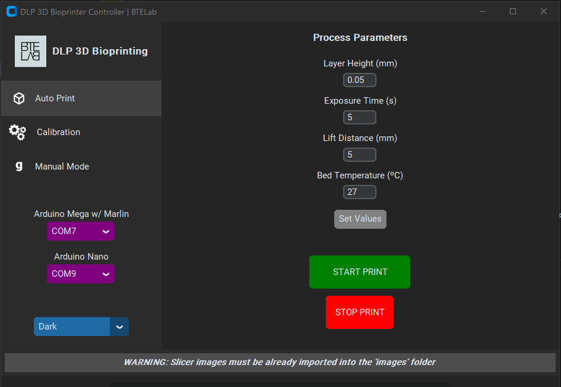
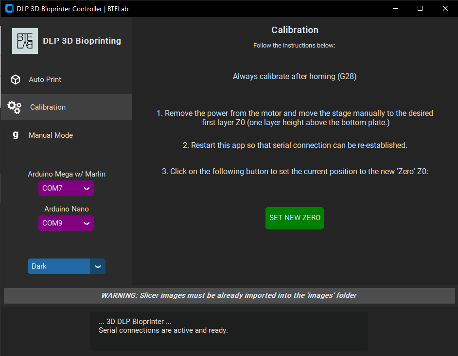
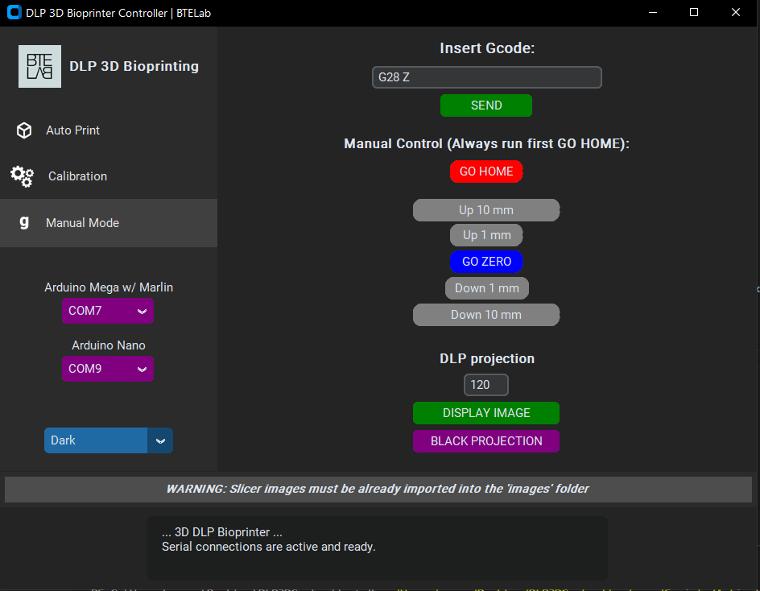

# DLP3DController

This project introduces a 3D printing Python controller application designed specifically for DLP (Digital Light Processing) printers. The GUI was created using the customtkinter library. To move the print carriage, automated gcode is sent via serial communication to an Arduino Mega 2560 with a RAMPS 1.4 shield and a slightly modified Marlin firmware (MillerLab SLATE). Each layer of the printing part is projected onto a modified DLP projector using the Pygame library.

## Features

Some of the project's features are:

    - Calibrate the main axis of the printer semi-automatically.
    - Display images on the projector manually.
    - Move the printer through a button interface.
    - Send custom gcode lines directly.
    - Automatic printing with process parameters control, such as layer height, exposure time or tank temperature.
    - Terminal output information through the GUI textbox.
    - Easy to establish serial communication by selecting the different ports in the GUI.

## User Interface

Here are some screenshots of the different sections of the interface:

  #### Auto Print Menu

  

  #### Calibration Menu

  

  #### Manual Control Menu

  
  
    
## Hardware

Some of the hardware used is listed below:

    - Arduino Mega 2560 + RAMPS 1.4 Shield w. Marlin Firmware.
    
    - Arduino Nano: allows motor enable pin and limit switch reading. This was implemented to know when a gcode 
                    is finished executing and avoid working with the buffer. It is necessary to synchronize the 
                    DLP images with the movement of the printer. 
                    
    - DC Motor ESS11-01.
    
    - Modified DLP projector.
    
    - 24 V Power Supply.
    
  #### Wiring
  | Pin               | Color             | Connections           |
  | ----------------- | ----------------- | --------------------- |
  | DC+               | RED               |  Z-VMOT               |
  | GND               | BLACK             |  Z-GND                | 
  | PU+               | LIGHT BLUE        |  Z-STEP               |
  | PU-               | PINK              |  GND                  |
  | DR+               | GREEN             |  Z-DIR                |
  | DR-               | DARK BLUE         |  GND                  |
  | Lim. Sw. NO       | -                 |  Ard. nano + Z MAX S  |
  | Lim. Sw. NO       | -                 |  Ard. nano + Z MAX -  |
  | Z-EN              | -                 |  Ard. nano            |

## Folder structure

  - Arduino Nano Files: Source code loaded into the Arduino Nano. It allows to reaad the enable motor pin and the homing limit switch, as well as establishing a serial communication.
  
  - **GUI_images:** Various images and icons used in the GUI.
  
  - **Marlin Modified:** Marlin Firmware loaded into the Arduino Mega 2560 with the RAMPS 1.4 shield. It has been slightly modified to activate the Z enable pin.
  
  - **images:** Slicer print part images. 
  
  - **venv:** Project's virtual environment. 
  
  - **requirements.txt:** Used Python Modules/Libraries. 
  
  - **run.pyw:** Main script. Double click to launch the GUI.

## Usage

  1.  First you must generate a set of .png images for the layers of the part to be printed. For this purpose, it is recommended to use the Chitubox software. It is necessary to configure a generic resin printer with a resolution corresponding to that of the DLP projector (1024 x 768 in our case). The slicer will generate a file and its extension can be changed to .zip to obtain the images in .png format. Import all slice images to the project folder called "images".
  
  2.  Connect the DLP projector via HDMI/VGA and extend the screen. 

  3.  Run the program and select the COM ports corresponding to the Arduino Mega with the Marlin firmware and the Arduino nano. 

  4.  Calibrate the printer before printing. To do this, follow the steps in the "Calibration" tab in the GUI.

  5.  In the "Auto Print" tab, select the process parameters and click on "Start Print" to start printing. 

  6.  If you want to use the printer in the "Manual Mode" tab, it is necessary to do a "homing (G28)" first. Whenever a "homing" is done, it will always be necessary to calibrate afterwards if printing is planned. 

## Installation

To install the DLP3DController program, follow these steps:

   1. Clone the repository to your local machine using the command `git clone https://github.com/anuargimenez/DLP3DController.git`.
   2. Make sure you have Python 3 installed on your machine.
   3. Install the required Python packages by running the command `pip install -r requirements.txt`.
   4. Run the program by double-clicking on **\run.pyw**.

## Code Notes

   - Threading was needed to run multiple events at the same time. This allows to continue interacting with the GUI while the printer is running, among others. 
   
   - Temperature activation and control is disabled by default. To use it, uncomment the code snippet *l. 381-385* in the main script *run.pyw*.
   
   - Calibration process. It is not possible to calibrate the printer by doing a (G92 Z0) on the first layer. Every time the printer is used, it needs to perform a      "homing (G28)" operation. After that, Marlin automatically makes the position of the limit switch Z=Z_MAX_POS, cancelling the previous calibration.
     Therefore, calibration is performed by measuring the distance between what should be the first layer and the position of the limit switch with an M114. With a      G92 the Zmax position of the limit switch is fixed at this distance after homing, forcing the desired position to be kept as Z0. 
     
## Authors
*Biomedical & Tissue Engineering Laboratory | BTELab*
- [Anuar R. Giménez El Amrani](https://www.github.com/anuargimenez)
- [Andrés Sanz García](https://www.github.com/mugiro)
